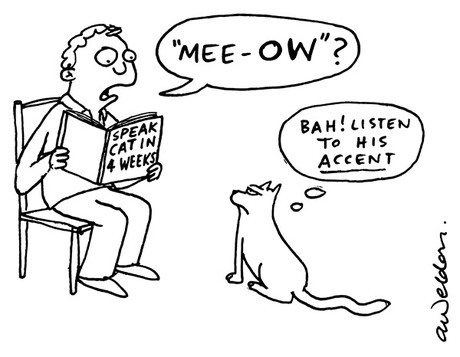

###So where ya'll from? 

Every person who speaks, or has ever spoken, has an accent, a lingering effect from a linguistic history. 

But how different are accents, really? With a unique dataset, recordings of 2132 people reading the same text:

"Please call Stella.  Ask her to bring these things with her from the store:  Six spoons of fresh snow peas, five thick slabs of blue cheese, and maybe a snack for her brother Bob.  We also need a small plastic snake and a big toy frog for the kids.  She can scoop these things into three red bags, and we will go meet her Wednesday at the train station."

First we have to convert these audio files to quantities we can work with, and then we will explore the relationship between one's gender, age, native language, and the various measurable quantities of the audio clip. After that, we'll build methods to classify speakers. 

Come on, even the computer knows you have an accent!

You can find our dataset here:
https://www.kaggle.com/rtatman/speech-accent-archive


```{r setup, include=FALSE}
library(tuneR)
library(seewave)
library(nnet) # nnet & multinom
library(gbm)
library(caret) # test result etc
library(randomForest) #RF
library(e1071) #SVM
library(ggplot2)
library(corrplot)
library(RColorBrewer)
knitr::opts_chunk$set(echo = TRUE)
#source("../lib/prediction.r")
```

##First Words
Although people can hear the differences between accents, a statistical model is deaf without a programmer's help. So first things first, converting the .mp3 files into measurable features.

Mp3s are great for our phones and computers because they save a lot of space. Where a raw, .Wav file may take up 50 megabytes, the compressed .Mp3 may be 5mb. However, this compression makes the files more difficult to work with and extract meaningful information. So we need to turn our 2132 mp3s into .wav files. 

Luckily, the package tuneR in R has a method to convert all of the files to the format we can work with. Then we're ready to start looking into the data. 


###Frequency
For one, we can look at the change in frequency, which we hear as pitch, over time. It's these changes in frequency and amplitude that allow us to enunciate. 
```{r freq}
ex_wave<-readWave("../data/english46.wav")
spectro(ex_wave,f=44100,flim=c(0,3.5),tlim=c(0,5),colbg = "lightgray",palette = terrain.colors)
 ex_wave2<-readWave("../data/dutch30.wav")
 spectro(ex_wave2,f=44100,flim=c(0,3.5),tlim=c(0,5),colbg = "lightgray",palette = terrain.colors)
```
Furthermore, we can look at the change in amplitude (loudness) over time. This shows us a visual understanding of the space between words or syllables and the range of volume a speaker uses. 

```{r}
osc<-oscillo(ex_wave,from=0,to=5)
osc2<-oscillo(ex_wave2,from=0,to=5)

```

The spectographic image is even more insightful. We can get an idea of the tone of a speakers voice. In these two plots, we see the spectograms of a low voice and a high voice. 
```{r}
ex_spec<-spec(ex_wave,main="Spectogram of Speaker with Deep Voice",from=0,to=5,flim=c(0,1.5))

```
Note the bump around 


```{r data}
ex_spec2<-spec(ex_wave2,main="Spectogram of Speaker with a High Voice",from=0,to=5,flim=c(0,1.5))
```
Note the way the high voice shows increased amplitudes at higher frequencies. It's differences like these that will allow us to classify accents! 

###Turning it into Data
While plots are great for visualization, they do little to help model differences in the audio clips quantitatively. To do that, we extract summary statistics from the audio files. We extract:

1. mean frequency (in kHz)
2.standard deviation of frequency
3.median frequency (in kHz)
4.standard error of frequency
5.mode of the frequency
6.first quantile 
7.third quantile 
8.interquantile range 
9.centroid
10.skewness
11.kurtosis
12.spectral flatness
13.spectral entropy
14.Precision of frequency
15.Mean Fundamental Frequency (Most prominent tone)
16.Min Fundamental Frequency
17.Max Fundamental Frequency
18.Mean Fundamental Frequency
19.Differential Range 
20.Modulation Index (measure of pace)

(Note if you are interested in the extraction process, check the lib folder for FeatureExtraction2.R. The process is computational and tedious so we omit it here) 

We then use these observed features to classify Age, Sex, and Country. 
```{r}
data<-read.csv("../output/all_features.csv")
data<-data[(data$age>0),]
data$sex[data$sex=="famale"]<-"female"
head(data[1:6])
head(data[7:12])
head(data[13:18])
head(data[19:23])
head(data[24:30])
```

###Exploratory Analysis
Before we start building our classifier, let's check out what's going on between our variables. 

```{r}
c<-cor(data[,2:23])
corrplot(c)
```
Well, we see that many of the frequency summary statistics contain similar information. This is expected, but it's promising to see such low correlation between fundamental frequencies and the frequency summary statistics. 

Let's take a closer look at the mean fundamental frequency. The fundamental frequency is defined as the lowest frequency observed in a waveform, so it should give us a great idea of the tone of voice. 
```{r}
ggplot(data)+geom_histogram(aes(meanfun),bins=60,fill="green")
```
Note the two peaks in fundamental frequency. It appears there's a significantly different fundamental frequency for two groups in our population. 
```{r}
ggplot(data)+geom_histogram(aes(meanfun,fill=sex),bins=60)+scale_fill_brewer(palette="Set1")
```

```{r}


```

```{r}
genderdf<-data[,c(2:23,28)]
genderdf$sex<-as.factor(genderdf$sex)
train<-round(.75*nrow(genderdf))
train.ind<-sample(1:nrow(genderdf),train)
traindata<-genderdf[train.ind,]
testdata<-genderdf[-train.ind,]


genderSVM<-svm(sex~.,data=traindata,gamma=.02,cost=2)
summary(genderSVM)
genderSVM$

#TrainTest
predictSvm <- predict(genderSVM, testdata)
table(predictSvm, testdata$sex)
sum(predictSvm ==testdata$sex)/length(testdata$sex)
#SVM.tune<-tune(svm,sex~.,data=traindata,
            #   ranges = list(gamma = c(0,.01,.02,.03,.04), cost = 2^(-1:2)))
#SVM.tune


```

```{r}
countrydf<-data[,c(2:19,21:23,30)]

tb<-sort(table(data$country),decreasing = T)
countrydf<-countrydf[data$country %in% names(tb[1:10]),]

countrydf$country<-droplevels(countrydf$country)
countrydf$country<-as.factor(countrydf$country)

train<-round(.75*nrow(countrydf))
train.ind<-sample(1:nrow(countrydf),train)
traindata<-countrydf[train.ind,]
testdata<-countrydf[-train.ind,]

countrySVM<-svm(country~.,data=traindata,gamma=.02,cost=4)

predictSvm <- predict(countrySVM, testdata)

table(predictSvm, testdata$country)

sum(predictSvm ==testdata$country)/length(testdata$country)


SVM.tune<-tune(svm,country~.,data=traindata,
              ranges = list(gamma = c(0,.01,.02,.03,.04), cost = 2^(2:4)))
SVM.tune

```

```{r}
tb<-sort(table(data$country),decreasing = T)
countrydf<-data[data$country %in% names(tb[1:2]) & data$sex=="female",]

countrydf$country<-droplevels(countrydf$country)
#rownames(countrydf)<-countrydf$country
scaledf<-scale(countrydf[,2:19,20:23])


kcountry<-kmeans(scaledf,2)
table(kcountry$cluster,countrydf$country)
d<-as.matrix(cbind(scaledf))
di<-dist(d)
hc<-hclust(di)
plot(hc)
clustercut<-cutree(hc,4)
table(clustercut,countrydf$country)

hcd<-as.dendrogram(hc)
plot(clustercut)

```


```{r}
#Recursive Feature Elimination
control<-trainControl(method="repeatedcv",number = 10, repeats = 3)
genderdf[,-23]<-scale(genderdf[,-23])
genderdf$sex<-droplevels(genderdf$sex) 
model<-train(country~.,data=countrydf,method="lvq", preProcess="scale", trControl=control)
importance<-(varImp(model,scale=F))
print(importance)
plot(importance)

# define the control using a random forest selection function
control <- rfeControl(functions=rfFuncs, method="cv", number=10)
# run the RFE algorithm
results <- rfe(sex~.,data=genderdf, sizes=c(1:8), rfeControl=control)
# summarize the results
print(results)
# list the chosen features
predictors(results)
# plot the results
plot(results, type=c("g", "o"))

```